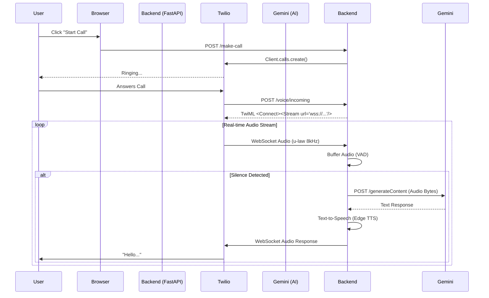

# Twilio Voice Integration Guide 📞

This guide explains how the Twilio Voice integration works in the **GoAccel Concierge Bot**, how to set it up, and how to troubleshoot common issues.

---

## 🏗️ Architecture Overview

The system allows users to initiate phone calls from the web interface. The conversation is handled by **Google Gemini 1.5 Flash** (standard API) for intelligence and **Edge TTS** for voice generation.

### **Flow Diagram**



---

## 🚀 Setup Instructions

### 1. Prerequisites
*   **Twilio Account:** Buy a phone number with Voice capabilities.
*   **ngrok:** To expose your local server to Twilio.
*   **ffmpeg:** Required for audio conversion (install globally on your system).

### 2. Environment Variables (`.env`)
Ensure these are set in your `.env` file:

```env
# Twilio Credentials (from Console > Account Info)
TWILIO_ACCOUNT_SID=AC...
TWILIO_AUTH_TOKEN=...
TWILIO_PHONE_NUMBER=+1...

# Google Gemini
GEMINI_API_KEY=...
```

### 3. Running the Server
You need **two** terminal windows.

**Terminal 1: Backend**
```bash
uvicorn main:app --reload --port 8000
```

**Terminal 2: Tunnel (ngrok)**
```bash
ngrok http 8000
```

### 4. Configure Twilio Webhook
1.  Copy the **https** forwarding URL from ngrok (e.g., `https://a1b2-c3d4.ngrok-free.app`).
2.  Go to **Twilio Console > Phone Numbers > Manage > Active Numbers**.
3.  Click your phone number.
4.  Scroll to **Voice & Fax** section.
5.  Under **"A CALL COMES IN"**:
    *   Select **Webhook**.
    *   URL: `https://YOUR-NGROK-URL.ngrok-free.app/voice/incoming`
    *   Method: **HTTP POST**.
6.  Click **Save**.

---

## 🧪 How to Test

1.  Open `http://localhost:8000` in your browser.
2.  Expand the **"📞 Make a Phone Call"** section in the chat widget.
3.  Enter your mobile number (e.g., `+1234567890`).
4.  Click **"Start Call"**.
5.  Answer the phone and speak to the AI!

---

## 🔧 Troubleshooting

### **Error 20003: Authenticate**
*   **Cause:** Invalid Account SID or Auth Token.
*   **Fix:**
    *   Check `.env` file for typos or extra spaces.
    *   Verify credentials in Twilio Console.
    *   Ensure you are using **Live** credentials, not Test credentials (unless intentional).

### **No Audio / Silence**
*   **Cause:** `ffmpeg` missing or WebSocket connection failed.
*   **Fix:**
    *   Check backend logs for `[ERROR]`.
    *   Ensure `ffmpeg` is installed (`ffmpeg -version` in terminal).
    *   Ensure ngrok URL in Twilio matches your current session.

### **Latency**
*   **Note:** Since we use the Standard API (buffering audio -> sending -> processing -> TTS), there is a natural delay of 1-3 seconds. This is expected behavior for this architecture. For lower latency, migration to Gemini Live API (Realtime WebSocket) is required.

---

## 📂 Key Files

*   **`services/twilio_voice_manager.py`**: Handles VAD, Audio Conversion, Gemini interaction, and TTS.
*   **`main.py`**: Contains endpoints `/make-call`, `/voice/incoming`, and `/media-stream`.
*   **`static/index.html`**: Frontend UI for initiating calls.
